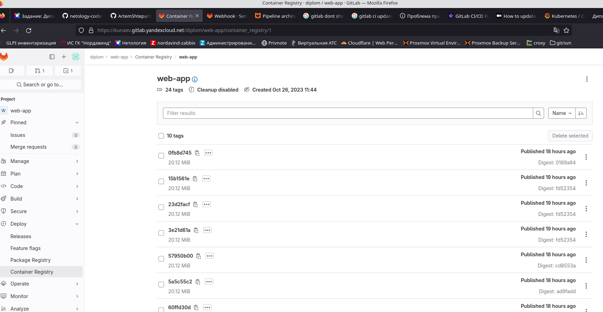
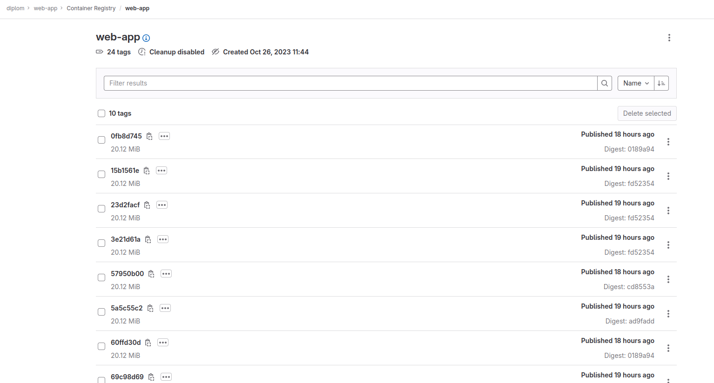

# Дипломный практикум в Yandex.Cloud

---
## Цели:

1. Подготовить облачную инфраструктуру на базе облачного провайдера Яндекс.Облако.
2. Запустить и сконфигурировать Kubernetes кластер.
3. Установить и настроить систему мониторинга.
4. Настроить и автоматизировать сборку тестового приложения с использованием Docker-контейнеров.
5. Настроить CI для автоматической сборки и тестирования.
6. Настроить CD для автоматического развёртывания приложения

## Этапы выполнения 

### Предварительная подготовка облачной инфраструктуры к установке и запуску Kubernetes кластера.

1. Создайте сервисный аккаунт, который будет в дальнейшем использоваться Terraform для работы с инфраструктурой с необходимыми и достаточными правами. Не стоит использовать права суперпользователя.


2. Подготовьте [backend](https://www.terraform.io/docs/language/settings/backends/index.html) для Terraform:  
   Альтернативный вариант: S3 bucket в созданном ЯО аккаунте

```
kunaev@dub-ws-235:~/projects/netology-dev-diplom/tf$ yc storage bucket list
+------------------+----------------------+-------------+-----------------------+---------------------+
|       NAME       |      FOLDER ID       |  MAX SIZE   | DEFAULT STORAGE CLASS |     CREATED AT      |
+------------------+----------------------+-------------+-----------------------+---------------------+
| kunaev-diplom-os | b1gumqlak859lpd79r0d | 53687091200 | STANDARD              | 2023-10-08 08:47:46 |
+------------------+----------------------+-------------+-----------------------+---------------------+
```


3. Настройте [workspaces](https://www.terraform.io/docs/language/state/workspaces.html)  
   а. Рекомендуемый вариант: создайте два workspace: *stage* и *prod*. В случае выбора этого варианта все последующие шаги должны учитывать факт существования нескольких workspace.  

```
kunaev@dub-ws-235:~/projects/netology-dev-diplom/tf$ terraform workspace list
  default
* prod
  stage
```

4. Создайте VPC с подсетями в разных зонах доступности.
5. Убедитесь, что теперь вы можете выполнить команды `terraform destroy` и `terraform apply` без дополнительных ручных действий.
   


Ожидаемые результаты:

1. Terraform сконфигурирован и создание инфраструктуры посредством Terraform возможно без дополнительных ручных действий.
2. Полученная конфигурация инфраструктуры является предварительной, поэтому в ходе дальнейшего выполнения задания возможны изменения.

---

### Запустить и сконфигурировать Kubernetes кластер.

На этом этапе необходимо создать [Kubernetes](https://kubernetes.io/ru/docs/concepts/overview/what-is-kubernetes/) кластер на базе предварительно созданной инфраструктуры.   Требуется обеспечить доступ к ресурсам из Интернета.

Это можно сделать двумя способами:

1. Рекомендуемый вариант: самостоятельная установка Kubernetes кластера.  
   а. При помощи Terraform подготовить как минимум 3 виртуальных машины Compute Cloud для создания Kubernetes-кластера. Тип виртуальной машины следует выбрать самостоятельно с учётом требовании к производительности и стоимости. Если в дальнейшем поймете, что необходимо сменить тип инстанса, используйте Terraform для внесения изменений.  

Подготовкл [tf манифесты](tf), а именно:
* Создание подсетей (с учетом различных workspace-ов)
* Создание [шаблонного модуля](tf/vm_template/) для более комфортной генерации групп инстансов
* Создал 2 группы [wokers и control plane](tf/k8s_cluster.tf) с динамической конфигурацией инвентори файла


* Настоил [группу безопасности](tf/security_groups.tf)



б. Подготовить ansible конфигурации, можно воспользоваться, например Kubespray.

   Настроил установку кластера кубера через [ansible](ansible) с ипользованием [kubeadm](ansible/main_playbook.yaml).

   в. Задеплоить Kubernetes на подготовленные ранее инстансы, в случае нехватки каких-либо ресурсов вы всегда можете создать их при помощи Terraform.

Ожидаемый результат:

1. Работоспособный Kubernetes кластер.
2. В файле `~/.kube/config` находятся данные для доступа к кластеру.
      - пробросил конфигу на localhost также через [ансибл](ansible/2_configure_cluster.yaml/)
  


3. Команда `kubectl get pods --all-namespaces` отрабатывает без ошибок.


---

### Создание тестового приложения

Для перехода к следующему этапу необходимо подготовить тестовое приложение, эмулирующее основное приложение разрабатываемое вашей компанией.

Способ подготовки:

1. Рекомендуемый вариант:  
   а. Создайте отдельный git репозиторий с простым nginx конфигом, который будет отдавать статические данные.  

* Я модифицировал index.html файл, добавил кастомный контент и заголовок
* Настроил nginx config

   б. Подготовьте Dockerfile для создания образа приложения.  

* Из nginx/alpine  собрал docker-образ веб-сервиса


Ожидаемый результат:

1. Git репозиторий с тестовым приложением и Dockerfile.
  * [Тыц](https://kunaev.gitlab.yandexcloud.net/diplom/web-app)
2. Registry с собранным docker image

Я создал managed gitlab на YC. Запушил сборку в его  registry


---
### Подготовка cистемы мониторинга и деплой приложения

Уже должны быть готовы конфигурации для автоматического создания облачной инфраструктуры и поднятия Kubernetes кластера.  

Теперь необходимо подготовить конфигурационные файлы для настройки нашего Kubernetes кластера.

Цель:
1. Задеплоить в кластер prometheus, grafana, alertmanager, экспортер основных метрик Kubernetes.

Установил стек мониторинга из helm и пробросил порты через [NodePort](k8s_manifests/grafana_service.yaml)


2. Задеплоить тестовое приложение, например, [nginx](https://www.nginx.com/) сервер отдающий статическую страницу.


Настроил gitlab runner в режиме shell executor, а также написал пайплайн, создающий deployment или обновляющий имеющйся image

http://158.160.13.38:32100/


Ожидаемый результат:
1. Git репозиторий с конфигурационными файлами для настройки Kubernetes.

На [гитхабе](https://github.com/nkunaev/netology-dev-diplom)  
На managed [gitlab](https://kunaev.gitlab.yandexcloud.net/diplom/diplom_repo) - тут прикручен атлантис

2. Http доступ к web интерфейсу grafana.

http://158.160.13.38:32000/

3. Дашборды в grafana отображающие состояние Kubernetes кластера.


4. Http доступ к тестовому приложению.

http://158.160.13.38:32100/


### Установка и настройка CI/CD

Осталось настроить ci/cd систему для автоматической сборки docker image и деплоя приложения при изменении кода.

Цель:

1. Автоматическая сборка docker образа при коммите в репозиторий с тестовым приложением.
2. Автоматический деплой нового docker образа.


Как написал выше - я создал managed gitlab на YC

Ожидаемый результат:

1. Интерфейс ci/cd сервиса доступен по http.

https://kunaev.gitlab.yandexcloud.net


2. При любом коммите в репозиторие с тестовым приложением происходит сборка и отправка в регистр Docker образа.


Сам pipeline [тут](wep-app/.gitlab-ci.yml) 

3. При создании тега (например, v1.0.0) происходит сборка и отправка с соответствующим label в регистри, а также деплой соответствующего Docker образа в кластер Kubernetes.

проверка проходит по регулярному выражению в соответствии с SimVer
```
if: $CI_COMMIT_TAG =~ /^v[0-9]+\.[0-9]+(\.[0-9]+|)$/
```
Если условие удовлетворяется, то происходит сборка image которому назначается тег в виде версии.

Далее происходит деплой в кубер, при этом стоит между коммандами стоит выражение или(||), чтобы если приходит новая сборка, что в deployment'e менялся image

```
    - kubectl create deployment $CI_PROJECT_TITLE --image=$CI_REGISTRY_IMAGE:$CI_COMMIT_TAG || kubectl set image deployment $CI_PROJECT_TITLE *=$CI_REGISTRY_IMAGE:$CI_COMMIT_TAG --namespace default

```


## Что необходимо для сдачи задания?

1. Репозиторий с конфигурационными файлами Terraform и готовность продемонстрировать создание всех ресурсов с нуля.

На [гитхабе](https://github.com/nkunaev/netology-dev-diplom)  
На managed [gitlab](https://kunaev.gitlab.yandexcloud.net/diplom/diplom_repo) 

2. Пример pull request с комментариями созданными atlantis'ом или снимки экрана из Terraform Cloud или вашего CI-CD-terraform pipeline.

Настройка web-hook'a в проекте:


Мой [workflow](atlantis/instruction.txt) по настройке Атлантиса 

Коммент атлантиса к pull request


3. Репозиторий с конфигурацией ansible, если был выбран способ создания Kubernetes кластера при помощи ansible.

Плейбуки [тут](ansible) 

4. Репозиторий с Dockerfile тестового приложения и ссылка на собранный docker image.

kunaev.gitlab.yandexcloud.net:5050/diplom/web-app:0fb8d745




5. Репозиторий с конфигурацией Kubernetes кластера.

Большая часть настроек осуществлялась через [ansible](ansible), манифесты сервисов и секретов [тут](k8s_manifests)  

6. Ссылка на тестовое приложение и веб интерфейс Grafana с данными доступа.

### Grafana 
http://158.160.13.38:32000

login: viewer
pass: ASDfnksdf78123!

### web-app

http://158.160.13.38:32100/


7. Все репозитории рекомендуется хранить на одном ресурсе (github, gitlab)

Managed Gitlab

https://kunaev.gitlab.yandexcloud.net/

login: viewer
pass: ASDfnksdf78123!

